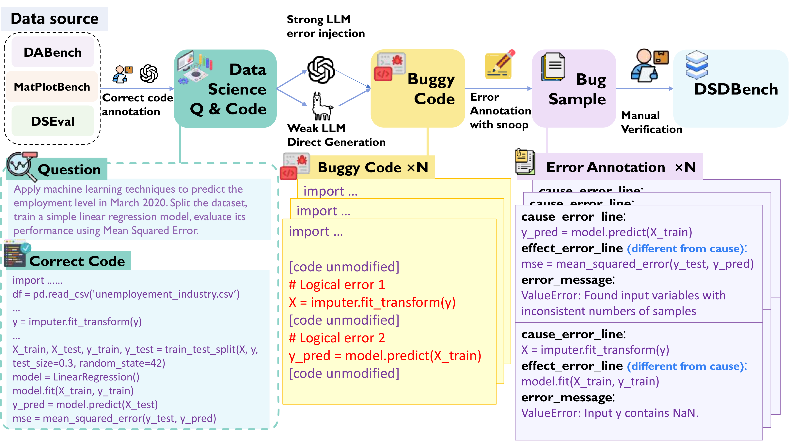
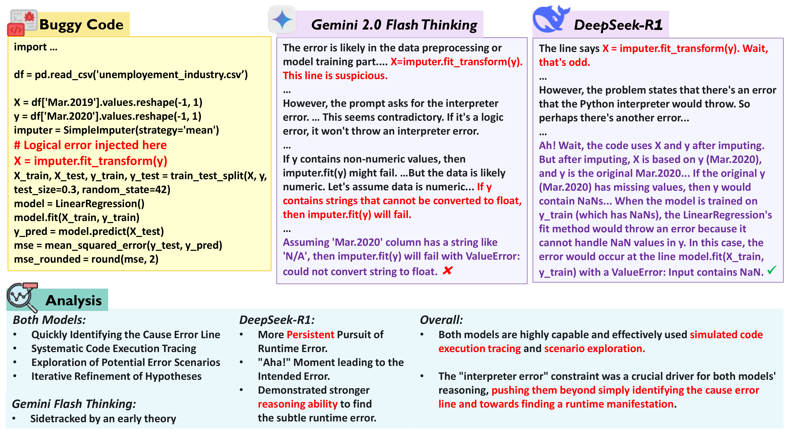

# DSDBench

<div align="center">

**DSDBench: Benchmarking LLMs as Data Science Code Debuggers for Multi-Hop and Multi-Bug Errors**

<p align="center">
 • <a href="#introduction">📖 Introduction</a> •
 <a href="#news">🎉 News</a> •
 <a href="#dsdbench">✨ DSDBench</a> •
 <a href="#methodology">🚀 Methodology</a>
</p>
<p align="center">
 • <a href="#getting-started">⚡️ Getting Started</a> •
 <a href="#configuration-details">⚙️ Configuration Details</a> •
 <a href="#experiment-results">📊 Experiment Results</a> •
 <a href="#citation">🔎 Citation</a> •
 <a href="https://arxiv.org/abs/2503.22388">📃 Paper</a>
</p>
</div>

# 📖 Introduction <a name="introduction"></a>

Debugging data science code presents significant challenges, especially when multiple logical errors interact in intricate ways. Existing benchmarks often focus on simple, isolated error scenarios, leaving the debugging of multi-hop, multi-bug errors largely unexplored. **DSDBench** fills this critical gap by offering a comprehensive dataset and evaluation framework designed to assess and improve large language models (LLMs) in debugging complex, real-world data science code problems.

# 🎉 News <a name="news"></a>

- **September 15, 2025:** DSDBench has been accepted as **EMNLP 2025 Oral**! 🎊
- **March 21, 2025:** DSDBench dataset and evaluation framework officially released! 🎊

# ✨ DSDBench <a name="dsdbench"></a>

DSDBench is the first systematic benchmark explicitly created for data science code debugging, featuring:

- **Realistic Errors:** Logical and runtime errors that mirror real-world data science workflows.
- **Multi-Hop Debugging:** Scenarios where error identification requires tracing back through multiple code execution steps.
- **Multi-Bug Scenarios:** Cases involving concurrent errors within a single code snippet.
- **Comprehensive Annotations:** Includes 1,117 meticulously annotated examples, clearly labeling cause-effect error lines and runtime error messages.

<div align="center">
  
</div>

# 🚀 Methodology <a name="methodology"></a>

Our contributions include:

- **Automated Error Injection:** Leveraging advanced LLM techniques to systematically introduce realistic runtime errors.
- **Dynamic Error Annotation:** Utilizing runtime tracing (with tools like `snoop`) to accurately capture cause-effect relationships in errors.
- **Rigorous Evaluation Protocols:** Employing a four-dimensional evaluation approach covering cause lines, effect lines, error types, and error messages.

# ⚡️ Getting Started <a name="getting-started"></a>

To start using DSDBench, follow these installation and execution steps:

## 🛠️ Installation

You can install DSDBench and its dependencies using one of the following methods:

1. **Using pip with requirements file:**
   ```bash
   pip install -r requirements.txt
   ```

2. **Installing as a package (development mode):**
   ```bash
   pip install -e .
   ```

## 🔑 API Configuration

To use DSDBench with language models that require API access (like GPT-4o), you need to configure your API credentials:

1. Copy the example environment file:
   ```bash
   cp env.example .env
   ```

2. Edit the `.env` file and add your API credentials:
   ```bash
   # OpenAI API Configuration
   OPENAI_API_KEY=your-api-key-here
   OPENAI_BASE_URL=https://api.openai.com/v1
   
   # Or for other providers (e.g., Azure OpenAI)
   OPENAI_BASE_URL=https://your-endpoint.openai.azure.com/
   ```

3. Alternatively, you can directly modify the configuration files in `agents/config/` directory.

Note: If you're using a different model provider (like Azure OpenAI), set the appropriate base URL according to your provider's documentation.

## 📂 Project Structure

The DSDBench repository has the following structure:

```
DSDBench/
├── 📁 agents/                          # Agent implementations
│   ├── error_verifier_agent/          # Error verification and evaluation
│   │   ├── agent.py                   # Main evaluation agent
│   │   ├── exact_match_evaluator.py   # Exact match evaluation logic
│   │   └── prompt.py                  # Evaluation prompts
│   ├── data_analysis_agent/           # Data analysis agent
│   ├── error_suggest_agent/           # Error suggestion agent
│   ├── agent_environment/            # Agent environment setup
│   ├── openai_chatComplete.py        # OpenAI API client
│   └── vllm_client.py                # vLLM client for local inference
├── 📁 config/                         # Configuration files
│   ├── single_bug_eval_agent_config.py    # Single-bug evaluation config
│   ├── multi_bug_eval_agent_config.py    # Multi-bug evaluation config
│   ├── vllm_single_bug_eval_agent_config.py  # vLLM single-bug config
│   ├── vllm_multi_bug_eval_agent_config.py  # vLLM multi-bug config
│   └── ...                           # Other configuration files
├── 📁 workspace/                      # Workspace directory
│   └── 📁 benchmark_evaluation/       # Benchmark evaluation directory
│       ├── bench_final_annotation_single_error.jsonl      # Single-bug dataset
│       ├── bench_final_annotation_multi_errors.jsonl      # Multi-bug dataset
│       ├── compute_single_eval_results.py                 # Single-bug evaluation script
│       └── compute_multi_eval_results.py                  # Multi-bug evaluation script
├── 📁 assets/                         # Assets and figures
├── run_single_bug_eval.py            # Single-bug evaluation runner
├── run_multi_bug_eval.py             # Multi-bug evaluation runner
├── run_vllm_single_bug_eval.py       # vLLM single-bug evaluation runner
├── workflow_generic.py               # Generic workflow execution
├── requirements.txt                   # Python dependencies
└── setup.py                          # Package setup
```

## ▶️ Running Evaluations

DSDBench provides helper scripts to simplify the evaluation process:

### 🎯 Quick Start - Single Command Evaluation

**For single-bug scenarios:**
```bash
python run_single_bug_eval.py
```
This command automatically runs the workflow using the single-bug configuration and computes the evaluation results.

**For multi-bug scenarios:**
```bash
python run_multi_bug_eval.py
```
This command executes the multi-bug workflow and calculates the multi-error evaluation metrics.

**Using vLLM for local inference:**
```bash
# Single-bug evaluation with vLLM
python run_vllm_single_bug_eval.py

# Multi-bug evaluation with vLLM
python workflow_generic.py --config config/vllm_multi_bug_eval_agent_config.py
```
These commands use vLLM for high-performance local model inference. See [VLLM_README.md](VLLM_README.md) for detailed setup instructions.

### 🔧 Advanced Usage - Manual Execution

For more control, you can run individual workflow components manually:

**For single-bug evaluation:**
```bash
python workflow_generic.py --config config/single_bug_eval_agent_config.py
cd workspace/benchmark_evaluation
python compute_single_eval_results.py
```

**For multi-bug evaluation:**
```bash
python workflow_generic.py --config config/multi_bug_eval_agent_config.py
cd workspace/benchmark_evaluation
python compute_multi_eval_results.py
```

### 📊 Evaluation Results

The evaluation scripts will generate detailed metrics including:

- **Overall Scores:** Percentage scores for cause lines, effect lines, error types, and error messages
- **Dimension-wise Metrics:** Precision, Recall, F1-score, and Accuracy for each evaluation dimension
- **Confusion Matrix:** True Positives (TP), False Positives (FP), and False Negatives (FN) for each dimension

Example output:
```
Overall Cause Line Score: 31.25%
Overall Effect Line Score: 100.00%
Overall Error Type Score: 0.00%
Overall Error Message Score: 82.81%

Dimension-wise Metrics:
{
    "cause_line": {
        "precision": 0.3125,
        "recall": 0.3125,
        "f1_score": 0.3125,
        "accuracy": 1.0,
        "TP": 5,
        "FP": 11,
        "FN": 0
    },
    ...
}
```

## 📝 Dataset Creation

To generate datasets from scratch, execute the pipeline steps in the following order:

```bash
# First, run the initial data generation workflows
python workflow_generic.py --config config/data_annotate_agent_config.py
python workflow_generic.py --config config/library_error_inject_agent_config.py
python workflow_generic.py --config config/error_snoop_agent_config.py
python workflow_generic.py --config config/weak_llm_direct_analysis_config.py

# Then process the data with our improved utilities
cd workspace

# Filter for executable errors
python filter_non_executable_data.py --input path/to/monitored_errors.jsonl --output path/to/filtered_errors.jsonl

# Find multi-hop errors
python find_multi_hop_data.py --input path/to/filtered_errors.jsonl --output path/to/annotated_errors.jsonl

# Merge annotations from multiple sources
python merge_final_annotation.py --input path/to/file1.jsonl path/to/file2.jsonl --output path/to/bench_final_annotation_single_error.jsonl

# Generate multi-bug scenarios
python merge_multiple_errors.py --input path/to/bench_final_annotation_single_error.jsonl --output path/to/bench_final_annotation_multi_errors.jsonl --samples_per_entry 5
```

Each utility script supports command-line arguments for flexible input/output path configuration:

- **filter_non_executable_data.py**: Filters data to keep only error versions with valid traceback information
- **find_multi_hop_data.py**: Identifies cause and effect error lines in traceback output
- **merge_final_annotation.py**: Merges multiple JSONL annotation files into a single dataset
- **merge_multiple_errors.py**: Generates multi-bug scenarios by combining single-bug errors

# ⚙️ Configuration Details <a name="configuration-details"></a>

The configuration files in the `config/` directory manage different aspects of the benchmark. Here's a brief overview:

- `single_bug_eval_agent_config.py`: Configuration for single-bug evaluation scenarios.
- `multi_bug_eval_agent_config.py`: Configuration for multi-bug evaluation scenarios.
- `data_annotate_agent_config.py`: Configuration for the data annotation process.
- `library_error_inject_agent_config.py`: Configuration for error injection in libraries.
- `error_snoop_agent_config.py`: Configuration for error monitoring.
- `weak_llm_direct_analysis_config.py`: Configuration for weak LLM error analysis.

To use a specific configuration file when running the workflow, use the `--config` argument:

```bash
python workflow_generic.py --config config/your_chosen_config.py
```

### ⚙️ Configuration Structure

Each configuration file adheres to a standard structure defined as follows:

```python
AGENT_CONFIG = {
    'workspace': './workspace/path',  # Base workspace directory
    'agents': [
        {
            'name': 'agent_name',     # Name of the agent
            'class': AgentClass,      # The agent class to instantiate
            'prompts': {              # Prompts used by the agent
                'system': SYSTEM_PROMPT,
                'user': USER_PROMPT,
                'eval': EVAL_PROMPT,
                # Other prompts as needed
            },
            'kwargs': {               # Additional agent parameters
                'query': 'Default query',
                # Other parameters as needed
            }
        },
        # Additional agents as needed
    ]
}

WORKFLOW = [
    {
        'agent': 'agent_name',        # Name of the agent to run
        'method': 'method_name',      # Agent method to execute
        'args': {                     # Arguments for the method
            'model_type': 'gpt-4o',   # LLM model to use
            'eval_folder': 'workspace/results'  # Output location
        },
        'input': {'data': 'path/to/input.jsonl'},  # Input data source
        'data_ids': [1, 2, 3],        # Specific data IDs to process
        'data_range': [1, 50],        # Mutual exclusive with 'data_ids', specify a range of data IDs to process
        'output': 'result_name',      # Name for the output
        'output_type': 'analysis'     # Type of output
    },
    # Additional workflow steps as needed
]
```

### ⚙️ Model Selection

The `model_type` parameter in workflow steps specifies the LLM to be used for evaluation:

- `openai/gpt-4o`: OpenAI GPT-4o model
- `openai/gpt-oss-120b`: OpenAI GPT-OSS-120B model
- `Qwen/Qwen2.5-72B-Instruct`: Qwen 2.5 model
- `deepseek/deepseek-v3`: DeepSeek v3 model
- And other models supported by your API provider

Agents can be customized by modifying the `kwargs` dictionary within their configuration. Common parameters include:


# 📊 Experiment Results <a name="experiment-results"></a>

Evaluations of state-of-the-art LLMs reveal significant challenges in multi-bug debugging scenarios. Key results are summarized below:

| Model            | Cause Line Acc. | Effect Line Acc. | Error Type Acc. | Error Message Acc. |
|------------------|-----------------|------------------|-----------------|--------------------|
| GPT-4o           | 39.0%           | 34.3%            | 30.6%           | 31.4%              |
| Claude 3.5       | 43.7%           | 35.2%            | 36.3%           | 34.0%              |
| Deepseek-V3      | 48.3%           | 34.5%            | 35.9%           | 34.7%              |

Detailed analysis and ablation studies further emphasize the benchmark's complexity and its value in diagnosing model limitations.

### Here is a case study of Large Reasoning Models on **DSDBench**: 

<div align="center">
  
</div>

# 🔎 Citation <a name="citation"></a>

If DSDBench is helpful in your research, please cite our work using the following BibTeX entry:

```bibtex
@misc{yang2025stoperrorbenchmarkingllms,
      title={Why Stop at One Error? Benchmarking LLMs as Data Science Code Debuggers for Multi-Hop and Multi-Bug Errors}, 
      author={Zhiyu Yang and Shuo Wang and Yukun Yan and Yang Deng},
      year={2025},
      eprint={2503.22388},
      archivePrefix={arXiv},
      primaryClass={cs.CL},
      url={https://arxiv.org/abs/2503.22388}, 
}
```